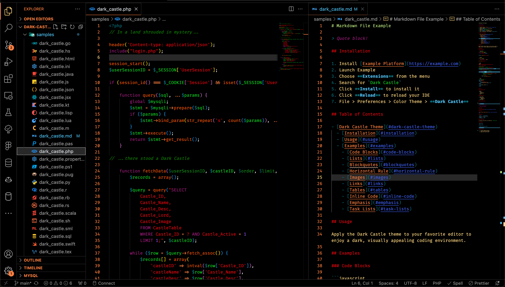

<!-- Begin README -->

    

<h1 align="center">🏰 Dark Castle Theme 🌲</img></h1>

> A Dark Theme for [Example](https://example.com).

Please visit **Dark Castle**'s main repository [here](https://github.com/scottgriv/Dark-Castle-Theme) for more information about how you can contribute to the project, and/or view the other available platforms.

Template reference to this repository [here](https://github.com/scottgriv/Dark-Castle-Template).

## Install

All instructions can be found in the included [INSTALL.md](INSTALL.md) file.

## Project

Please reference the [GitHub Project](https://github.com/users/scottgriv/projects/14) tab inside this repository to get a good understanding of where I'm currently at with the overall project.
- Issues and Enhancements will also be tracked there as well.

## Discussions

Please join the [GitHub Discussions](https://github.com/scottgriv/Dark-Castle-Theme/discussions) to discuss this project!
- Issues and Enhancements will be discussed there as well.

## Contributing

Please reference the [CONTRIBUTING](.github/CONTRIBUTING.md) file in this repository for more details.

## Changelog

Please reference the [CHANGELOG](.github/CHANGELOG.md) file in this repository for more details.

## License

This project is released under the terms of the **MIT License**, which permits use, modification, and distribution of the code, subject to the conditions outlined in the license.
- The [MIT License](https://choosealicense.com/licenses/mit/) provides certain freedoms while preserving rights of attribution to the original creators.
- For more details, see the [LICENSE](LICENSE) file in this repository. in this repository

<!-- End README -->
